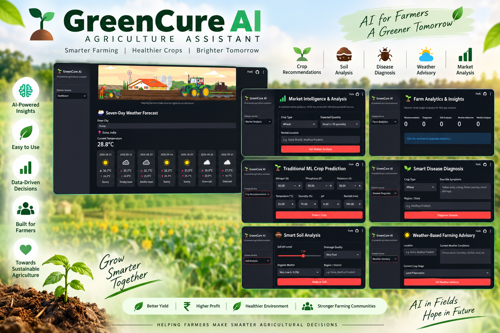

# 🌱 GreenCure AI — Agriculture Assistant

GreenCure AI is a Streamlit-based agriculture assistant that combines a Random Forest crop recommendation model, weather forecasting, and Groq-powered AI guidance for farming decisions.

<p align="center">
  
</p>


## ✨ Features

- 🌾 ML-based crop prediction using N, P, K, temperature, humidity, pH and rainfall
- 🤖 AI crop recommendations using Groq + LangChain
- 🔬 AI-assisted crop disease diagnosis
- 🌱 Soil analysis and suitable-crop suggestions
- 🌦️ Seven-day weather forecast using WeatherAPI
- 📈 Farm analytics dashboard
- 📄 Downloadable TXT and PDF reports
- 🔐 Local `.env` support and Streamlit Cloud Secrets support

## 🛠️ Tech Stack

- Python
- Streamlit
- Scikit-learn
- Pandas / NumPy
- Plotly
- LangChain + Groq
- WeatherAPI
- ReportLab

## 📂 Project Structure

```text
.
├── app.py
├── agricultural_util.py
├── crop_recommendation.py
├── weather.py
├── model.pkl
├── requirements.txt
├── .env.example
├── .gitignore
├── datasets/
│   └── Crop_recommendation.csv
└── images/
    ├── crop_banner.jpg
    └── weather.jpg
```

## 🚀 Run Locally

### 1. Clone the repository

```bash
git clone YOUR_GITHUB_REPOSITORY_URL
cd ai-agriculture-assistant
```

### 2. Create a virtual environment

```bash
python -m venv .venv
```

Windows:

```bash
.venv\Scripts\activate
```

macOS/Linux:

```bash
source .venv/bin/activate
```

### 3. Install dependencies

```bash
pip install -r requirements.txt
```

### 4. Create `.env`

Copy `.env.example` to `.env` and add your own keys:

```env
GROQ_API_KEY_1=your_key
GROQ_API_KEY_2=your_key
GROQ_API_KEY_3=your_key
GROQ_API_KEY_4=your_key
WEATHER_API_KEY=your_weatherapi_key
WEATHER_BASE_URL=https://api.weatherapi.com/v1
```

### 5. Start Streamlit

```bash
streamlit run app.py
```

## ☁️ Deploy on Streamlit Community Cloud

1. Push the project to GitHub.
2. Keep `.env` out of the repository.
3. Open Streamlit Community Cloud and create a new app.
4. Select the GitHub repository and `app.py` as the main file.
5. Open **Manage app → Settings → Secrets**.
6. Add your secrets in TOML format:

```toml
GROQ_API_KEY_1 = "your_key"
GROQ_API_KEY_2 = "your_key"
GROQ_API_KEY_3 = "your_key"
GROQ_API_KEY_4 = "your_key"
WEATHER_API_KEY = "your_weatherapi_key"
WEATHER_BASE_URL = "https://api.weatherapi.com/v1"
```

7. Save and reboot/redeploy the app.
